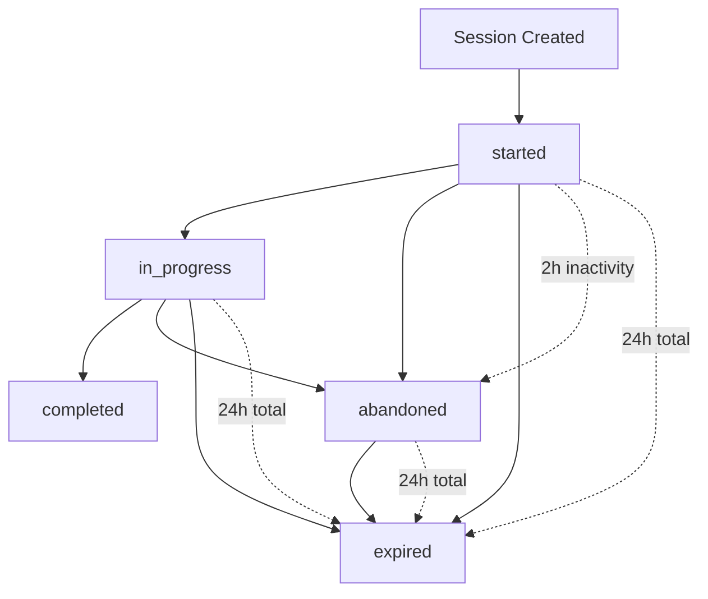

# Session Management System

This document describes the enhanced session management system that provides reliable session tracking even when users close browsers or lose network connectivity.

## Overview

The system combines client-side session tracking with database-side automation to ensure accurate session status management.

## Components

### 1. Database Layer (`supabase/migrations/20250826020000_session_status_automation.sql`)

**Database Functions:**
- `update_session_status()`: Automatically updates session statuses based on activity patterns
- `check_session_status_on_update()`: Trigger function that runs on session updates
- `cleanup_survey_sessions()`: Main cleanup function for external schedulers
- `get_session_analytics()`: Provides session analytics and statistics

**Database Triggers:**
- `trigger_session_status_update`: Automatically updates session status when activity occurs

**Automatic Status Updates:**
- Sessions move from `started` → `in_progress` when user progresses to section > 0
- Sessions become `abandoned` after 2 hours of inactivity
- Sessions become `expired` after 24 hours total time
- All status changes are logged in session metadata

### 2. Edge Function (`supabase/functions/session-cleanup/index.ts`)

A Supabase Edge Function that can be called by external cron services or schedulers to perform session cleanup.

**Endpoint:** `POST /functions/v1/session-cleanup`

**Response Example:**
```json
{
  "timestamp": "2025-08-26T02:00:00.000Z",
  "abandoned_sessions": 5,
  "expired_sessions": 2,
  "success": true,
  "message": "Session cleanup completed successfully"
}
```

### 3. Database Session Manager (`src/services/database-session-manager.service.ts`)

A client-side service that periodically calls cleanup functions and manages session lifecycle.

**Features:**
- Light cleanup every 5 minutes using database functions
- Full cleanup every 30 minutes via Edge Function (fallback to database)
- Automatic initialization when app starts
- Manual cleanup trigger available

### 4. Enhanced Session Hook (`src/hooks/use-survey-session.ts`)

**Improvements:**
- Reduced reliance on client-side timers
- Database triggers handle status transitions
- Focus on activity tracking and answer persistence
- Better error handling and recovery

## Session Status Lifecycle



## Session Statuses

| Status | Description | Triggers |
|--------|-------------|----------|
| `started` | Session created, no progress made | Initial state |
| `in_progress` | User has progressed past first section | `current_section > 0` |
| `completed` | User submitted the survey | Manual completion |
| `abandoned` | No activity for 2+ hours | Database trigger |
| `expired` | Total session time > 24 hours | Database trigger |

## Implementation Benefits

### ✅ Reliable Status Tracking
- Database triggers ensure status updates even if client disconnects
- No dependency on client-side JavaScript timers
- Handles browser crashes, network issues, and page closures

### ✅ Answer Persistence
- Survey answers automatically saved to session metadata
- Users can refresh page and continue where they left off
- Works across different devices with same session token

### ✅ Analytics Accuracy
- Accurate completion rates and abandonment tracking
- Clear distinction between technical issues and user abandonment
- Detailed metadata for each status transition

### ✅ Performance Optimized
- Debounced database writes reduce server load
- Efficient batch processing for cleanup operations
- Minimal client-side resource usage

## Setup Instructions

### 1. Apply Database Migration

```bash
# Option A: Using Supabase CLI (recommended)
supabase db push

# Option B: Using our custom script
node scripts/apply-session-automation-migration.js
```

### 2. Deploy Edge Function (Optional)

```bash
supabase functions deploy session-cleanup
```

### 3. Configure External Cron (Optional)

Set up a cron job to call the cleanup function regularly:

```bash
# Every 30 minutes
*/30 * * * * curl -X POST "https://your-project.supabase.co/functions/v1/session-cleanup" \
  -H "Authorization: Bearer YOUR_ANON_KEY"
```

### 4. Verify Setup

Check that the system is working:

```sql
-- View current session statistics
SELECT get_session_analytics();

-- Manual cleanup test
SELECT cleanup_survey_sessions();

-- Check recent sessions
SELECT id, status, created_at, last_activity_at, 
       EXTRACT(EPOCH FROM (NOW() - last_activity_at))/3600 as hours_since_activity
FROM survey_sessions 
ORDER BY created_at DESC 
LIMIT 10;
```

## Monitoring and Maintenance

### Key Metrics to Monitor

1. **Session Completion Rate**
   ```sql
   SELECT 
     COUNT(*) FILTER (WHERE status = 'completed') * 100.0 / 
     COUNT(*) FILTER (WHERE status IN ('completed', 'abandoned', 'expired')) as completion_rate
   FROM survey_sessions 
   WHERE created_at > NOW() - INTERVAL '7 days';
   ```

2. **Average Session Duration**
   ```sql
   SELECT 
     AVG(EXTRACT(EPOCH FROM (last_activity_at - started_at))/60) as avg_minutes
   FROM survey_sessions 
   WHERE status = 'completed' 
   AND created_at > NOW() - INTERVAL '7 days';
   ```

3. **Abandonment Patterns**
   ```sql
   SELECT 
     current_section,
     COUNT(*) as abandonment_count
   FROM survey_sessions 
   WHERE status = 'abandoned'
   AND created_at > NOW() - INTERVAL '7 days'
   GROUP BY current_section
   ORDER BY current_section;
   ```

### Troubleshooting

**Common Issues:**

1. **Sessions not updating status automatically**
   - Check that the migration was applied correctly
   - Verify triggers exist: `\d+ survey_sessions` in psql
   - Check function exists: `SELECT cleanup_survey_sessions();`

2. **Edge Function not working**
   - Verify function is deployed: `supabase functions list`
   - Check logs: `supabase functions logs session-cleanup`
   - Test manually via Dashboard or curl

3. **High number of abandoned sessions**
   - Review user experience and form complexity
   - Check for technical issues preventing progress
   - Consider adjusting abandonment timeout in database function

## Migration from Old System

The new system is backward compatible with existing sessions. Old sessions will be processed by the new triggers and cleanup functions automatically.

**What Changed:**
- Client-side abandon timers removed
- Database triggers added for automatic status updates
- More reliable session lifecycle management
- Enhanced metadata tracking

**What Stayed the Same:**
- Session creation and completion flows
- Answer persistence functionality
- API interfaces and hooks
- Data structure compatibility